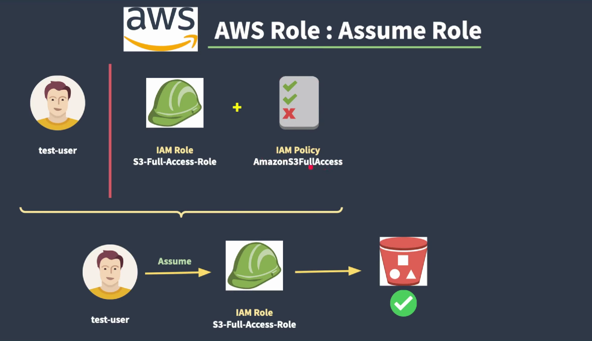

# 🧠 AWS Fundamentals + IAM 

## 💻☁️ What is Cloud Computing?

- Cloud computing means storing and accessing data, apps, and services over the internet, instead of your local computer or server.

- ➡️ Think of it like using electricity from a power grid ⚡—you don’t generate it yourself; you just plug in and use it.

- Similarly, with cloud computing, you don’t need to own big, expensive computers — you just use computing power from the internet!

- On-demand delivery of IT services (servers, storage, databases, networking, software) over the internet.

#### 🌐 Everyday Example
- 📷 Uploading photos to Google Drive or iCloud? That’s cloud computing.
- 🎵 Streaming music on Spotify? That’s cloud computing.
- 📧 Checking Gmail? Yep, cloud computing again!

#### ☁️ Key Features of Cloud Computing
| Feature                    | Meaning                                                        |
| -------------------------- | -------------------------------------------------------------- |
| **On-demand** 🕒           | Use services whenever you need them.                           |
| **Scalable** ⬆️⬇️          | Add or reduce resources easily.                                |
| **Pay-as-you-go** 💰       | Only pay for what you use—like a utility bill.                 |
| **Accessible Anywhere** 🌍 | Just need internet—access from laptop, phone, etc.             |
| **No Maintenance** 🧰      | The cloud provider (like AWS, Google, Azure) takes care of it. |

#### 🧠 Types of Cloud Services

1. IaaS (Infrastructure as a Service) 🧱
- Virtual machines, storage, networks
- Example: Amazon EC2

2. PaaS (Platform as a Service) 🛠️
- Tools to build apps without managing hardware
- Example: Google App Engine

3. SaaS (Software as a Service) 💼
- Use ready-to-go software via the web
- Example: Gmail, Zoom, Dropbox

#### 📈 Why Is It So Popular?
- No upfront hardware costs 🧾
- Easy to scale 🔧
- Fast deployment 🚀
- Supports remote work 👨‍💻🌎

### 💻✨ What is Virtualization?
Virtualization is the process of creating a virtual version of something — like a computer, server, storage, or network — using software.

#### 🧠 Imagine This:
- You have one powerful computer (🖥️), but you split it into many mini-computers (called virtual machines or VMs) inside it. Each one runs its own operating system and apps, just like a real computer!

- 🔧 So instead of one app using one physical computer, you can have many apps using the same computer, but in isolated environments.

```yaml
Before Virtualization:     After Virtualization:
----------------------     ----------------------
One Server = One App       One Server = Many Apps
 Wasting resources 😞        Better usage 😊

```

### ☁️ How Did Virtualization Revolutionize Cloud Computing?
1. ✅ Efficient Resource Use
- Before: Servers were underused 💤
- After: Multiple VMs on one server = no waste ⚡

2. 🧱 Foundation of the Cloud
- Cloud providers like AWS, Google Cloud, and Azure use virtualization to offer:
     - Virtual machines
     - Storage
     - Networking
- All of it is possible because virtualization lets them share hardware across many users safely.

3. 💸 Lower Costs
- Fewer physical servers = lower hardware & maintenance costs
- You pay only for what you use 💰

4. ⚡ Faster Deployment
- Want a new server? Click a button, and it’s ready in minutes ⏱️
- No need to buy or install hardware

5. 🌍 Scalability & Flexibility
- Cloud providers can quickly scale up/down based on demand.
- Businesses can go global without setting up servers everywhere 🌐

6. 🔒 Security & Isolation
- Each VM is isolated. If one fails or gets hacked, others are safe 🛡️

#### 📌 In Summary:
| Without Virtualization | With Virtualization (Cloud Era) |
| ---------------------- | ------------------------------- |
| One app per server 🖥️ | Many apps per server 💡         |
| Costly and slow 💸🕒   | Cheap and fast 💰⚡              |
| Limited scalability 🔻 | Easy to scale 🔼                |
| Hardware dependent 🔧  | Accessible from anywhere 🌍     |


### 💼 Real-World Example:
> Imagine you own a coffee shop ☕.  
> Before cloud: you buy your own espresso machine (server), maintain it, repair it.  
> With cloud: you **rent** a perfectly working espresso machine **only when needed**.

----

## 🌐 2. Public vs Private Cloud

| | Public Cloud | Private Cloud |
|--|--------------|----------------|
| 💼 Ownership | AWS, Azure, GCP | Your company |
| 🔒 Control | Limited | Full |
| 💸 Cost | Low startup, scalable | High upfront |
| ⚙️ Setup | Easy | Complex |

### 💼 Real-World Example:
> A **startup** uses AWS (public) to save money.  
> A **bank** uses a private cloud for security.  
> A **hospital** may use hybrid: patient records on-prem, website on AWS.

## 🕰️ 3. Life Before the Cloud

| Old Method | Cloud |
|------------|--------|
| Buy physical servers | Launch EC2 in seconds |
| Power/cooling costs | Included |
| Manual backup | Built-in (S3, RDS) |
| Scaling = weeks | Auto Scaling in mins |

### 💼 Real-World Example:
> Netflix used to ship DVDs 📀.  
> Now, using AWS, they stream video globally 🌍 — no physical servers of their own!

## 🧭 4. AWS Overview & Global Infrastructure

### 🧱 Components:
- **Regions** (e.g., `us-east-1`)
- **AZs** (e.g., `us-east-1a`)
- **Edge Locations** for low-latency content delivery

```
           🌍 Region (us-east-1)
          ┌────────────┬────────────┐
          │   AZ-1     │   AZ-2     │
          └────┬───────┴────┬───────┘
               ▼            ▼
          📍 Edge Location (NYC, London)
```

### 💼 Real-World Example:
> AWS Region = City (e.g., Virginia)  
> AZ = Different power zones within the city  
> Edge Locations = Neighborhood corners with data caches (like mini-warehouses)

## ⭐ 5. Why AWS is the Leader

| Feature | Benefit |
|--------|---------|
| 🌍 Largest reach | 30+ Regions, 99 AZs |
| 🧠 Innovation | AI, ML, IoT, Robotics |
| 💪 Reliability | 99.999% uptime |
| 🔒 Security | Encryption, compliance |
| 💼 Enterprises | Netflix, Airbnb, NASA use AWS |

### 💼 Real-World Example:
> NASA used AWS to **stream Mars Rover footage** to millions.  
> Airbnb scales up/down using EC2, S3, Lambda based on demand.

## 🆓 6. Free Tier & Cost Tracking

### ✅ Free for 12 months:
| Service | Limit |
|--------|--------|
| EC2 | 750 hrs/month (t2.micro) |
| S3 | 5 GB |
| RDS | 750 hrs/month |
| Lambda | 1M requests |

### 💰 Best Practices:
- Enable **billing alerts**
- Use **Cost Explorer**
- Use **Budgets** to track

### 💼 Real-World Example:
> You host a **portfolio website** on a free-tier EC2 + S3.  
> Get alerts if you go over free limits using Budgets.

## 💻 7. AWS Console vs CLI

| Console | CLI |
|--------|-----|
| Web UI | Terminal |
| Visual | Scriptable |
| Best for learning | Best for automation |

### 💼 Real-World Example:
> A **DevOps engineer** automates EC2 launches using CLI.  
> A **new learner** explores via AWS Console.

## 🔐 8. IAM – Identity & Access Management

- IAM (Identity and Access Management) is a security tool in AWS that helps you:

- ✅ Control who can access your AWS account
- ✅ Decide what they can do (read, write, delete, etc.)
- ✅ Protect your AWS resources from unauthorized use

Think of IAM as the security guard 🛡️ at the front gate of your AWS cloud.

### 👤 IAM User
- A user is an identity used for long-term credentials (like passwords or access keys).
- It represents a person or application that interacts with AWS.
- Each IAM user can:
     - Belong to groups
     - Be attached to policies directly
     - Have login credentials (AWS Console) and/or programmatic access (CLI, SDKs)

- *🔹 Example: A developer in your team named “Ram” with access to EC2 and S3.*

### 👥 IAM Group
- A group is a collection of users.
- You can attach policies to the group, and all users in the group inherit the permissions.
- Groups simplify management: change permissions in one place instead of updating each user.
- *🔹 Example: A group called “Developers” with access to S3 and CloudWatch; all developers get these permissions.*

### 📜 IAM Policy
- A policy is a JSON document that defines permissions using statements.
- Each statement defines:
     - Effect: Allow or Deny
     - Action: What can be done (e.g., s3:GetObject)
     - Resource: Where (e.g., a specific bucket)

**Policies can be:**

🔸 a. Managed Policies
- AWS Managed: Provided and maintained by AWS (e.g., AmazonS3ReadOnlyAccess)

- Customer Managed: You create and manage these for more control.

🔸 b. Inline Policies
- Attached directly to a user, group, or role.
- Cannot be reused across entities. Good for tightly scoped permissions.

### 🧰 IAM Role
- A role is an identity with temporary credentials, not tied to a person.
- Used by:
     - AWS services (e.g., EC2 assumes a role to access S3)
     - Users from other AWS accounts
     - Federated users (e.g., from Google, Microsoft AD)
- You assume a role temporarily; it's often used for cross-account access or service-to-service access.
- *🔹 Example: An EC2 instance role that allows it to write logs to CloudWatch.*


### 🚧 Permission Boundary
- A Permission Boundary is an advanced IAM feature that sets the maximum permissions an IAM user or role can have — even if their policies allow more.
- Think of it as a “guardrail” or ceiling for permissions.


### 🔑 How IAM Works – Simple Terms

| IAM Concept                 | Description                                                                              |
| --------------------------- | ---------------------------------------------------------------------------------------- |
| **User**                    | Long-term identity for a person or app                                                   |
| **Group**                   | Collection of users; policies applied to group                                           |
| **Policy (Managed/Inline)** | JSON document defining actions, resources, and conditions                                |
| **Role**                    | Temporary identity assumed by services, users, or federated identities                   |
| **Permission Boundary**     | Limits the maximum permissions a user or role can have, no matter what their policy says |


- Imagine IAM as the security gatekeeper for your AWS environment. Here's a simplified diagram to illustrate how IAM manages access:

```
  ┌────────────┐       ┌────────────┐
  │   User     │──────▶│   Group    │
  └────────────┘       └─────┬──────┘
                              ▼
                         ┌──────────┐
                         │ Policy   │
                         └──────────┘
```

```sql
+------------------+       +------------------+       +------------------+
|   IAM Entities   |       |    IAM Policies  |       |   AWS Resources  |
|------------------|       |------------------|       |------------------|
| - Users          |       | - Identity-Based |       | - EC2 Instances  |
| - Groups         |<----->| - Resource-Based |<----->| - S3 Buckets     |
| - Roles          |       | - Permissions    |       | - RDS Databases  |
+------------------+       +------------------+       +------------------+
```

- IAM Entities: Represent the identities (users, groups, roles) that need access.
- IAM Policies: Define what actions are allowed or denied for these identities.
- AWS Resources: The services and data (like EC2, S3, RDS) that identities want to access.

### 🛠️ Real-World Use Case: Managing Access in a Company
**Scenario:** You're the AWS administrator for a company, and you need to set up access controls for different team members.

1. Developers:
     - Requirement: Need full access to EC2 instances for development purposes.
     - Solution:
          - Create an IAM Group named Developers.
          - Attach a policy granting full EC2 access to this group.
          - Add developer IAM Users to the Developers group.

2. Interns:
     - Requirement: Should only view EC2 instances, not modify them.
     - Solution:
          - Create an IAM Group named Interns.
          - Attach a policy that allows only read-only access to EC2.
          - Add intern IAM Users to the Interns group.

3. Third-Party Application:
     - Requirement: An external application needs to upload logs to an S3 bucket.
     - Solution:
          - Create an IAM Role with permissions to write to the specific S3 bucket.
          - Define a Trust Policy allowing the third-party application to assume this role.
          - The application assumes the role and uploads logs securely.

## 🧑‍🔧 9. Hands-On Labs

### 🔹 A. Create AWS Account & Enable MFA

1. Sign up at [aws.amazon.com](https://aws.amazon.com)
2. Enable MFA for root user:
   - IAM → Security Credentials → MFA → Virtual MFA
   - Use Authenticator App

### 🔹 B. Create IAM User, Group, and Policy

```bash
aws iam create-group --group-name S3ReadGroup
aws iam attach-group-policy   --group-name S3ReadGroup   --policy-arn arn:aws:iam::aws:policy/AmazonS3ReadOnlyAccess
aws iam create-user --user-name DevUser
aws iam add-user-to-group   --user-name DevUser   --group-name S3ReadGroup
```

### 🔹 C. Configure AWS CLI

```bash
aws configure
```

- Enter Access Key & Secret
- Default Region: `us-east-1`
- Output format: `json`

### 💼 Real-World Example:
> You give your **developer** an IAM user + CLI setup so they can deploy from their local machine without full admin rights.

