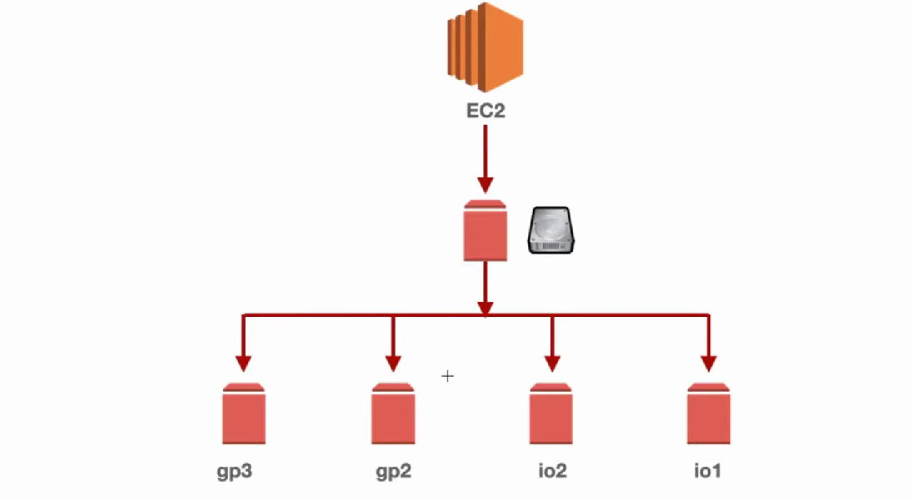

# 🧠 EC2 + Elastic IP + EBS + AMIs 

---

## 🚀 Amazon EC2 – Elastic Compute Cloud

### 💡 What is EC2?
- EC2 (Elastic Compute Cloud) is Amazon Web Services' virtual server offering. 
- It allows you to launch and manage virtual machines (called instances) in the cloud.
- Amazon EC2 provides **resizable virtual servers** (instances) to run applications in the cloud.
    - Can run Linux or Windows OS
    - Scalable: vertical and horizontal scaling
    - Integrates with most AWS services (S3, RDS, CloudWatch, etc.)
    - Enables highly available and fault-tolerant deployments

*Think of EC2 as a rental computer in the cloud where you can run applications, host websites, or process data.*

---

###  Key Features of EC2:

| Feature             | Description                                                       |
| ------------------- | ----------------------------------------------------------------- |
| **Scalability**     | Easily scale up or down the number of instances as needed.        |
| **Customizable**    | Choose CPU, memory, storage, OS (Linux, Windows), and networking. |
| **Elastic IP**      | Static public IP address you can assign to an instance.           |
| **Storage Options** | Use **EBS (Elastic Block Store)** for persistent storage.         |
| **Security**        | Control access via **Security Groups** and **Key Pairs**.         |
| **Pricing Models**  | On-Demand, Reserved, Spot, and Savings Plans to optimize cost.    |


### 🔸 Common Use Cases:
- Hosting websites and web apps
- Running backend servers and APIs
- High-performance computing and batch processing
- Development and testing environments
- Machine learning training and inference


## 🧩 EC2 Instance Types & Pricing Models

### 📦 EC2 Instance Families:
| Family | Use Case |
|--------|----------|
| **t** (e.g., t2.micro) | General purpose |
| **m** | Balanced compute/memory |
| **c** | Compute optimized |
| **r** | Memory optimized |
| **g/p/inf** | GPU/accelerated workloads |
| **d/h/i** | Storage optimized workloads |
| **x/z** | High memory enterprise workloads |

### 💸 EC2 Pricing Models:
| Model | Description | Use Case |
|-------|-------------|----------|
| **On-Demand** | Pay per hour/second | Dev/Test |
| **Reserved** | 1 or 3-year commitment | Long-term workloads |
| **Spot** | Use unused capacity at discount | Batch, fault-tolerant jobs |
| **Savings Plan** | Flexible pricing for 1-3 years | Cost-efficient, flexible |
| **Dedicated Hosts** | Physical server for regulatory needs | Licensing/Compliance |

🧠 **Real-World Example:**
> A startup launches their web app using **t2.micro** on-demand during early testing. As traffic grows, they shift to **Reserved Instances** to save cost. For AI training, they use **p3.2xlarge Spot Instances**.

---

## 🌐 Elastic IP + 🔐 Security Groups + 🔑 Key Pairs

### 🌍 Elastic IP:
- A **static IPv4 address** for dynamic cloud hosting
- Can be remapped between instances
- Allocated to your account until released
- Only one free Elastic IP per running instance

💡 Use when you want a **fixed public IP** (e.g., DNS mappings, reboots)

### 🔐 Security Groups:
- Virtual firewall to control **inbound/outbound traffic**
- Stateless: need separate rules for inbound and outbound
- Can associate multiple EC2s with one security group
- Rules are evaluated as **allow-only** (default deny)

### 🔑 Key Pairs:
- SSH Key (private/public) used to log in to EC2
- Must be downloaded at creation – can’t be retrieved again
- You can create using EC2 or import your own key

🧠 **Real-World Example:**
> You host a Node.js app and need to SSH into EC2 regularly. You use a Key Pair to access it and a Security Group to allow only port 22 and 3000. Elastic IP ensures consistent connection.

---

## 💾 Amazon EBS – Elastic Block Store

### 📂 EBS Volumes:
- Amazon EBS is a block-level storage service designed for use with EC2 instances. It provides persistent, high-performance storage volumes that can be attached to one or more EC2 instances.

- *Think of EBS like a virtual hard drive for your EC2 instance.*

- Durable block storage that persists beyond EC2 lifecycle
- Can attach/detach volumes to/from instances in same AZ
- **Types:** gp3 (default), io1/io2 (high IOPS), st1/sc1 (throughput optimized)
- Auto replication within AZ for durability



#### 🔹 Why Do We Need EBS?
1. Persistent Storage
    - Unlike EC2 instance store, EBS volumes retain data even after the EC2 instance is stopped or terminated (unless explicitly deleted).
2. Attachable and Detachable
    - You can detach an EBS volume from one EC2 instance and attach it to another — useful for backup, migration, or debugging.

3. Flexible Sizing and Performance
4. Backup with Snapshots
    - Easily create EBS Snapshots, which are incremental backups stored in Amazon S3.
    - Snapshots can be used to restore or create new volumes.

5. Encryption
    - EBS supports encryption at rest and in transit, using AWS-managed or customer-managed keys.

6. High Availability
    - EBS volumes are replicated within the same Availability Zone, protecting against single point failures.

#### 🔄 EBS Lifecycle:
1. Create a volume
2. Attach to EC2
3. Format and mount on the instance
4. Use like a regular drive
5. Detach, snapshot, or delete as needed

#### 🧠 Analogy:
- EC2 = Computer (CPU + RAM)
- EBS = Hard Disk or SSD you plug into it
- S3 = External storage or USB drive used for storing backups or sharing


### 📸 Snapshots:
- Backup of EBS volumes stored in S3
- Incremental: only changes saved after first snapshot
- Can automate via **Amazon Data Lifecycle Manager**

### 🔒 Encryption:
- Default or custom KMS key
- Encryption covers data at rest, in transit, and snapshots
- Automatically encrypts new volumes and snapshots

🧠 **Real-World Example:**
> Your app stores uploaded files. You use a separate **EBS volume** for storage, take **snapshots nightly**, and encrypt volumes for compliance.

### Commands

```bash
🔍 Check if the volume is visible and get details
	lsblk
    lsblk -f 
	
Lists all disks and partitions, with detailed information about size and type.
	sudo fdisk -l
	
Checks if the volume has an existing filesystem
	sudo file -s /dev/xvdf  # Output like data means it's unformatted.

🛠️ Create a filesystem 
	sudo mkfs -t ext4 /dev/xvdf # Formats the volume with the XFS filesystem. You can replace xfs with ext4 or another supported type.
	
📂 Create a mount point and mount the volume
	sudo mkdir /myebsvol
	sudo mount /dev/xvdf /myebsvol # Mounts the formatted volume to the specified directory.

📊 Verify the mount
	df -h
    df -Th
```
---

## 🧪 AMI – Amazon Machine Images
- An Amazon Machine Image (AMI) is a pre-configured template that contains the necessary information to launch a new EC2 instance.
- *Think of an AMI as a blueprint or snapshot of a computer — it defines the OS, installed software, configurations, and permissions for your EC2 server.* 

### 🔹 What Does an AMI Include?
1. Operating System
e.g., Amazon Linux, Ubuntu, Windows Server

2. Application Server or Software
e.g., Apache, NGINX, MySQL, Java runtime

3. Custom Configuration Files
Your own scripts or settings

4. EBS Snapshot
Backing storage volume(s) with data and system state

5. Permissions
Who can use the AMI (public, private, shared)

### 🔧 Types of AMIs:
| AMI Type             | Description                                                            |
| -------------------- | ---------------------------------------------------------------------- |
| **AWS-provided**     | Official images maintained by AWS (e.g., Amazon Linux, Windows Server) |
| **Marketplace AMIs** | Images from 3rd-party vendors (e.g., Bitnami, Red Hat)                 |
| **Custom AMIs**      | AMIs you create from your own EC2 setup                                |
| **Shared AMIs**      | AMIs shared with specific AWS accounts or made public                  |


### 🏗️ Custom AMI:
- Pre-installed software + configuration
- Reuse across multiple EC2 instances
- Save time when launching similar environments
- Backup your fully configured EC2 for disaster recovery


### 🔄 AMI Lifecycle:
1. Launch an EC2 instance
2. Configure it as needed (install software, modify settings)
3. Create an AMI from that instance
4. Use the AMI to launch new instances whenever needed


🎯 Use Case:
- Scale EC2 quickly with pre-configured environments
- Create golden images for web/app/database servers
- Backup and restore environments

🧠 **Real-World Example:**
> Your dev team installs LAMP stack on EC2. Once tested, you create an AMI and use it to launch 10+ similar EC2s across Regions for global deployment.

---

## 📜 EC2 Metadata & User Data Scripts

### 🔎 Metadata:
- Info about the instance (e.g., instance-id, IP, hostname)
- Access with: `http://169.254.169.254/latest/meta-data/`
- Useful for automation tools and custom scripts

### ⚙️ User Data:
- Bash script runs **on first boot** (only once)
- Automate package installation, updates, and software configuration
- Can be base64 encoded or plaintext

🧠 **Real-World Example:**
> To automate setup of an Apache web server:
```bash
#!/bin/bash
sudo apt-get update -y
sudo apt-get install apache2 -y

HOSTNAME=$(hostname)
IP=$(hostname -I | awk '{print $1}')

cat <<EOF | sudo tee /var/www/html/index.html > /dev/null
<html>
  <body>
    <h1>Welcome to Apache Server</h1>
    <p>Hostname: $HOSTNAME</p>
    <p>IP Address: $IP</p>
  </body>
</html>
EOF

sudo systemctl enable apache2
sudo systemctl start apache2

timedatectl set-timezone Asia/Kolkata
```

---

## 🛠️ Hands-On Labs

### 🔹 1. Launch EC2 with Custom User-Data Script
- Use Amazon Linux 2
- Add the Apache install script as user-data
- Set Security Group to allow HTTP (port 80)
- Access via browser using EC2 Public IP or Elastic IP

### 🔹 2. Create and Attach EBS Volume
- Create volume in same AZ
- Attach to EC2 instance
- Format using `mkfs -t xfs /dev/xvdf`
- Mount to `/data`
- Persist mount using `/etc/fstab`

### 🔹 3. Take Snapshot & Create Custom AMI
- Go to EC2 → Volumes → Take Snapshot
- Use Snapshot to create a new Volume
- Or create AMI directly from running instance (includes EBS)
- Launch new EC2 using your custom AMI

### 🔹 4. Allocate and Associate Elastic IP
- Go to EC2 → Elastic IPs → Allocate New Address
- Associate with your instance
- Update DNS record to map domain to Elastic IP

---

## ✅ Summary Checklist

| ✅ Task | Covered |
|--------|---------|
| EC2 Types & Pricing | ✔️ |
| Elastic IP, SG, Key Pair | ✔️ |
| EBS + Snapshots + Encryption | ✔️ |
| Custom AMIs | ✔️ |
| Metadata + User Data | ✔️ |
| Hands-on EC2 + Volume + AMI | ✔️ |
| Elastic IP Hands-on | ✔️ |
| Snapshot Automation & fstab mount | ✔️ |

---

